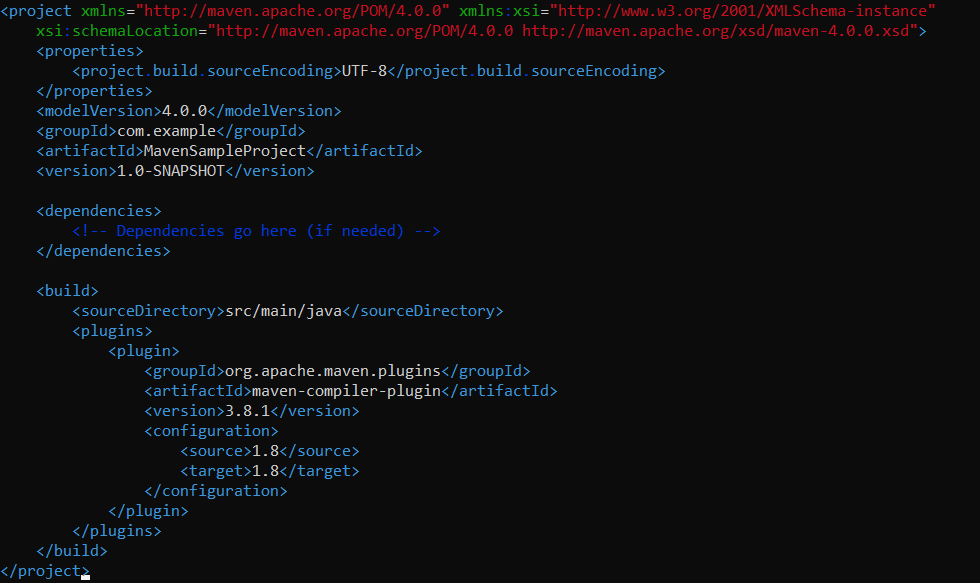

# SimpleJavaProject
Project demonstrating the usage of maven in tandem with a simple Java project.

## Project directory structure

## Executing the Java code

## POM file

## Building the Java project using Maven

## Executing the generated artifact

# Thank You